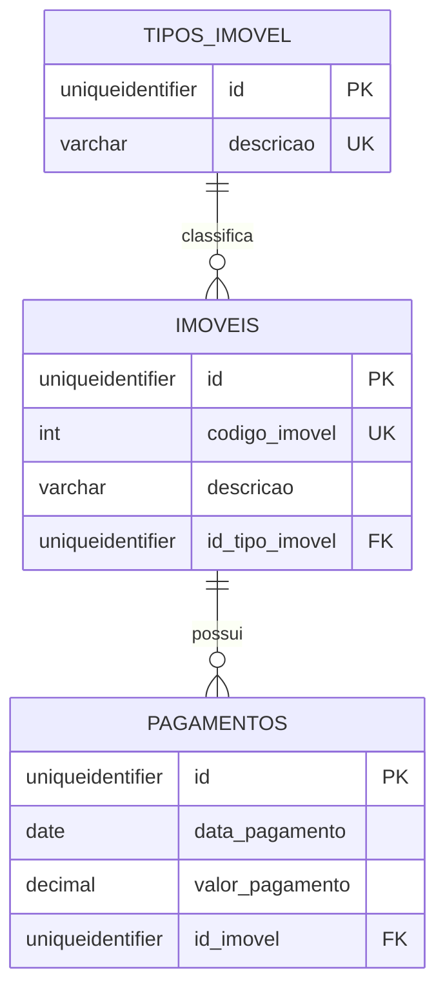

# Modelo entidade-relacionamento

```mermaid
erDiagram
    TIPOS_IMOVEL ||--o{ IMOVEIS : classifica
    IMOVEIS ||--o{ PAGAMENTOS : possui

    TIPOS_IMOVEL {
        uniqueidentifier id PK
        varchar descricao UK
    }

    IMOVEIS {
        uniqueidentifier id PK
        int codigo_imovel UK
        varchar descricao
        uniqueidentifier id_tipo_imovel FK
    }

    PAGAMENTOS {
        uniqueidentifier id PK
        date data_pagamento
        decimal valor_pagamento
        uniqueidentifier id_imovel FK
    }
```

## Cardinalidades

- `tipos_imovel` 1:N `imoveis`.
- `imoveis` 1:N `pagamentos`.
